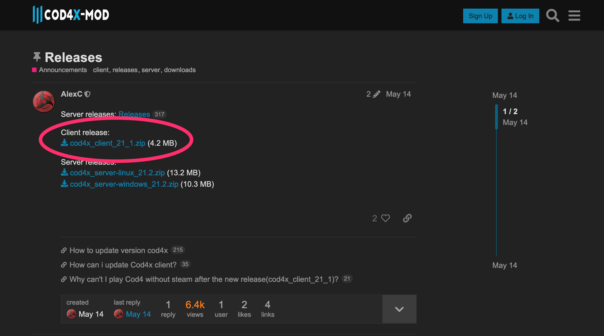

1. [ディスク版のみ] CoD4 をバージョン1.7までアップデート
    - Steam 版の人は何もしなくてOK
    - 以下のファイルは cod4x .me 上で公開されていたファイルです。問題ないとは思いますが不安な方はウィルススキャンなどを実施してから実行してください。
        - パッチ実行ファイル: https://drive.google.com/file/d/1-f5znTxDlSceg6YmDZxTR4WS_xAvkflI/view?usp=sharing
        - [参照元](https://old.cod4x.ovh/index.php?/forums/topic/12-how-to-install-cod4x/)
2. 1度 CoD4 Multiplayer を起動する
3. CoD4X のフォーラムから `cod4x_client_21_1.zip` をダウンロード
    - https://cod4x.ovh/t/releases/24  

4. ダウンロードした Zip ファイルを解凍し、解凍後に表示される `cod4-client-manualinstall_21.1` フォルダを CoD4 の main フォルダにコピーする
5. コピーした main フォルダ内の `cod4-client-manualinstall_21.1` フォルダに移動する
6. `install.cmd` を実行する
7. 「何かキーを押してください...」と表示されたら任意のキーを入力してウィンドウを閉じる
8. CoD4 Multiplayer が起動できることを確認する
